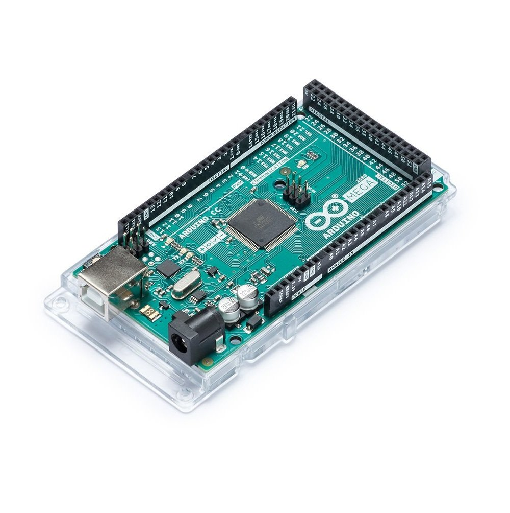
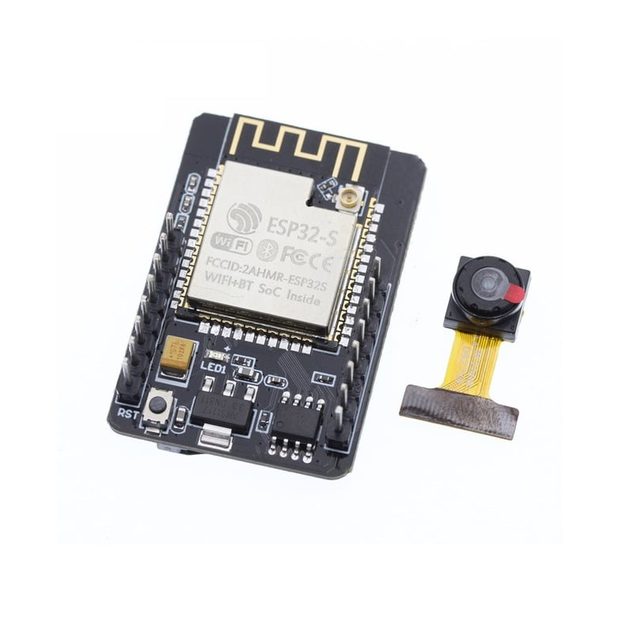
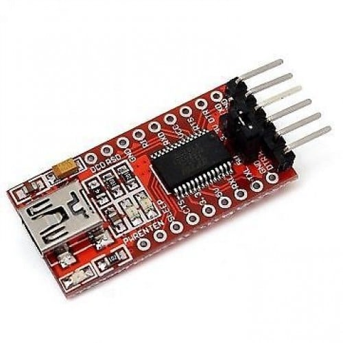
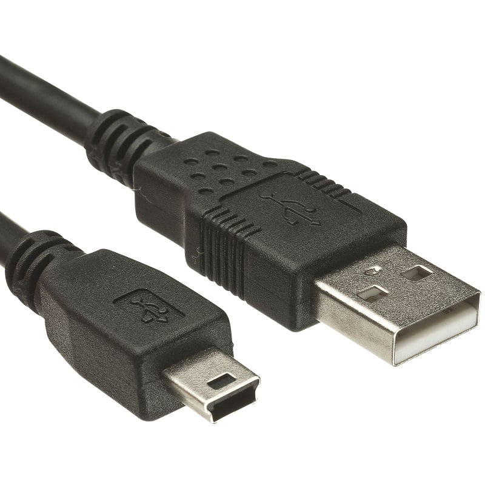
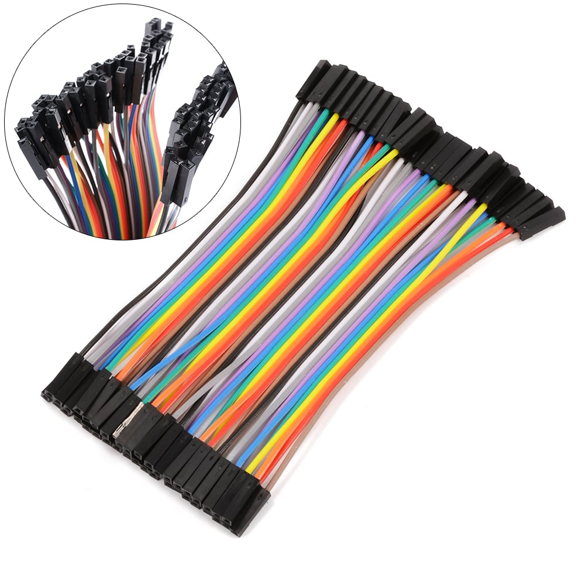

# Web Controls for IOT projects

This next app provides a human interface to contol the connected IOT (Internet of things) projects.

## Project Ideas:
1. Control Home switches to turn of/off Lights, Fans.
2. Intruder detection
3. When in office, see if a delivery partner is at your house or not and verify the package drop
4. Fly a drone remotely
5. Run a car remotely

Technologies used:
1. Websockets

Boards, Modules & Components used:

1. [Original Arduino Mega 2560 ATmega2560 MCU Rev3](https://robu.in/product/original-arduino-mega-2560-atmega2560-mcu-rev3/)

2. [Cable for Arduino UNO/MEGA (USB A to B)-1M](https://robu.in/product/cable-for-arduino-uno-mega-usb-a-to-b-1m/)

3. [ESP32 CAM WiFi Module Bluetooth with OV2640 Camera Module 2MP For Face Recognization](https://robu.in/product/esp32-cam-wifi-module-bluetooth-with-ov2640-camera-module-2mp/)

4. [USB TO UART TTL 5V 3.3V FT232RL Download Cable To Serial Adapter Module For Arduino](https://robu.in/product/ft232rl-usb-to-ttl-5v-3-3v-download-cable-to-serial-adapter-module-for-arduino/)

5. [Cable For Arduino Nano USB A to MINI B (Nickel Plated Connector)-1.2 M](https://robu.in/product/cable-for-arduino-nano-usb-a-to-mini-b-4-5-feet-nickel-plated/)

6. [10CM Female to Female Breadboard Jumper DuPont 2.54MM 1P-1P Cable 40 Pcs](https://robu.in/product/10cm-female-female-breadboard-jumper-dupont-2-54mm-1p-1p-cable-40-pcs/)

## Useful Links
Boilerplate Credits: https://creativedesignsguru.com/demo/Nextjs-Boilerplate/

ESP32 Cam using FTDI Programmer & Arduino IDE: https://randomnerdtutorials.com/program-upload-code-esp32-cam/
